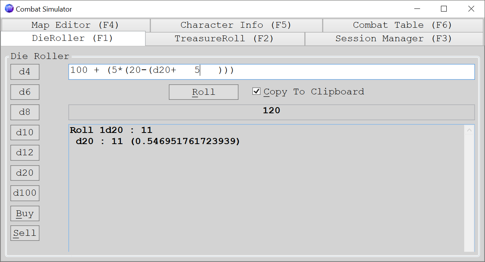
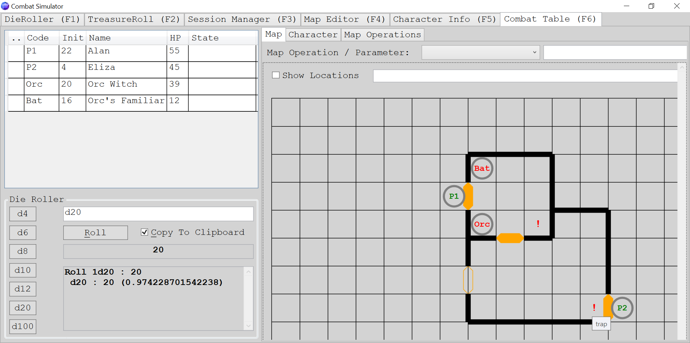

# DnD 3.5 Combat Table Simulator
a combat table simulator for DnD (supposed to be for 3.5)

Simple die roller

The very simple simulator in act

it supports below features:
* Die roller like "3d6" or complex ones including paranthesis like "3d6 + 5d100 - (4*(d20))"
* Map Editor, very basic, can put walls, doors and notes
* Character editor, can put characters with full detail, almost everything can be put here
* Combat Simulator screen, not fully automated, for table top games.
* Manager Screen, saves everything into XML on the fly (in memory) and this screen persist to file or reads it. useful for saving data

Treasure roller screen requires a treasure.xml file but due to copyright issues I deleted it. It shall probably crash at that screen.

## Techstack

Heavily uses WPF, on Character screen especially. some special structures used there (MVVM, COmmands, DataTemplates etc...)

Heavily uses XML for storage

The map is Winforms functionality which I had no idea how to do that part in the past

A self made algorithm to perform complex mathematical operations including dice (3d6 can be between 3-18 and so on) 

Code is very old, it is not new so there are some parts unused, obsolete. I just pushed it here now for showcase and storage purposes

## Usage
Never fully used, some time for storing characters in our DND sessions but too cumbersome to fill everything there. provides functionality though. currently using for die roller which is working perfect for my needs.

Requires a lot of manual work but things can be fast if templates are provided.
